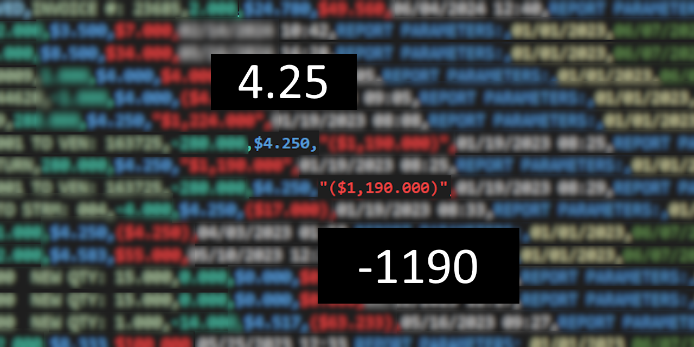

# String to Numeric

[](https://www.npmjs.com/package/@cityssm/string-to-numeric)
[](https://app.deepsource.com/gh/cityssm/string-to-numeric/)
[](https://codeclimate.com/github/cityssm/string-to-numeric/maintainability)
[](https://codecov.io/gh/cityssm/string-to-numeric)
[](https://github.com/cityssm/string-to-numeric/actions/workflows/coverage.yml)

**Parses formatted numeric strings into numbers. Handles cases `parseFloat()` misses.**

Helpful when importing formatted data.



Supports formatted numeric strings that are not supported by Javascript's
`parseInt()` and `parseFloat()` functions, including:

| Formatting                                                              | Example          | `Number.parseFloat()` | String to Numeric |
| ----------------------------------------------------------------------- | ---------------- | --------------------- | ----------------- |
| Numbers with thousands separators                                       | `"1,234.56"`     | ❌ `1`                | ✔️ `1234.56`      |
| Numbers with surrounding brackets<br /> (common in accounting)          | `"(6000)"`       | ❌ `NaN`              | ✔️ `-6000`        |
| Numbers with leading units                                              | `"$54.32"`       | ❌ `NaN`              | ✔️ `54.32`        |
| Numbers using a comma decimal separator<br /> (with optional parameter) | `"1,23"`         | ❌ `1`                | ✔️ `1.23`         |
| Combinations of formatting                                              | `"($65,432.10)"` | ❌ `NaN`              | ✔️ `-65432.1`     |

## Installation

```sh
npm install @cityssm/string-to-numeric
```

## Usage

```javascript
import stringToNumeric from '@cityssm/string-to-numeric'

console.log(stringToNumeric('1,234.56'))
// => 1234.56

console.log(stringToNumeric('$54.32'))
// => 54.32
```

## Note

The decimal separator will attempt to be detected based on the computer's settings.
If the computer's locale settings do not match the decimal separator in string being parsed,
set the `decimalSeparator` option.

```javascript
console.log(stringToNumeric('1,23', { decimalSeparator: ',' }))
// => 1.23
```
